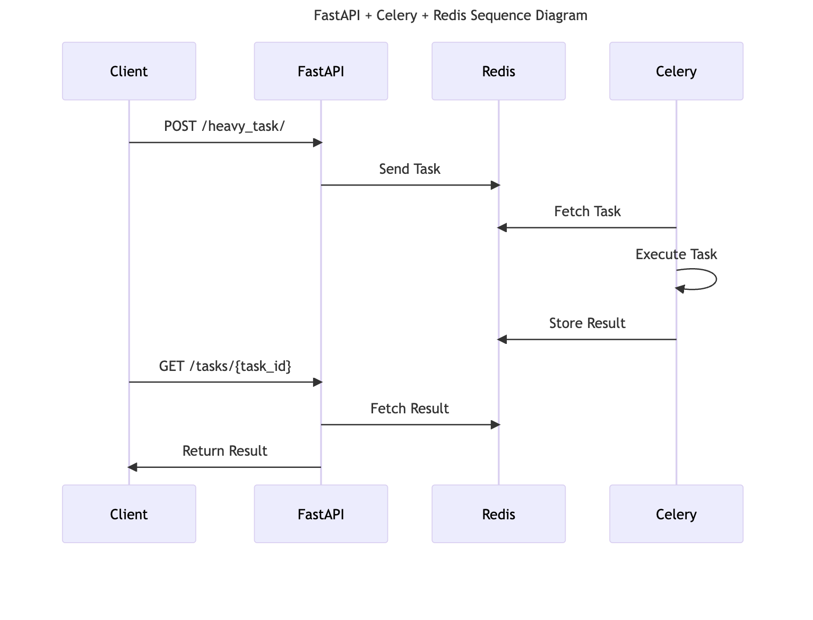

# FastAPI + Celery + Redis - Background Heavy Computaion tasks

This project demonstrates how to integrate [FastAPI](https://fastapi.tiangolo.com/) with [Celery](https://docs.celeryq.dev/) for background task processing, using [Redis](https://redis.io/) as both the broker and result backend. The project uses [uv](https://github.com/astral-sh/uv) as the Python package manager for fast and reliable dependency management.



## Features

- **FastAPI**: Modern, fast web framework for building APIs.
- **Celery**: Distributed task queue for running background jobs.
- **Redis**: Used as both the message broker and result backend for Celery.
- **uv**: Ultra-fast Python package manager for dependency management and virtual environments.
- **Docker-ready**: Easily adaptable for containerized deployments.

## Project Structure

```
.
├── app/
│   ├── __init__.py
│   ├── main.py           # FastAPI app with endpoints
│   ├── tasks.py          # Celery task definitions
│   └── celery_worker.py  # Celery app configuration
├── .env                  # Environment variables (e.g., REDIS_URL)
├── pyproject.toml        # Python dependencies
├── uv.lock               # uv lockfile
└── README.md
```

## Setup

1. **Install [uv](https://github.com/astral-sh/uv)** (if not already installed):

   ```sh
   curl -Ls https://astral.sh/uv/install.sh | sh
   # or with Homebrew:
   brew install astral-sh/uv/uv
   ```

2. **Install dependencies**

   ```sh
   uv venv
   source .venv/bin/activate
   uv pip install -r requirements.txt  # If requirements.txt exists
   # or, to install from pyproject.toml:
   uv pip install .
   ```

   Or simply:

   ```sh
   uv pip install -r pyproject.toml
   ```

3. **Configure Redis**

   Make sure Redis is running locally or update the `REDIS_URL` in your `.env` file:

   ```
   docker run --name local-redis -p 6379:6379 -d redis:alpine
   ```

   ```env
   REDIS_URL="redis://localhost:6379/0"
   ```

4. **Start the Celery worker**

   ```sh
   uv pip install celery[redis]  # Ensure celery and redis dependencies are installed
   celery -A app.celery_worker.celery_app worker --loglevel=info
   ```

5. **Run the FastAPI app**

   ```sh
   uvicorn app.main:app --reload
   ```

## Usage

- **Health check:**  
  `GET /health/`

- **Start a heavy computation task:**  
  `POST /heavy_task/`  
  Body: `{ "duration": 5 }`

- **Check task status:**  
  `GET /tasks/{task_id}`

- **List active tasks:**  
  `GET /list_active_tasks/`

## Example Request

```sh
curl -X POST "http://localhost:8000/heavy_task/?duration=5"
```

## License

sunki ;)
